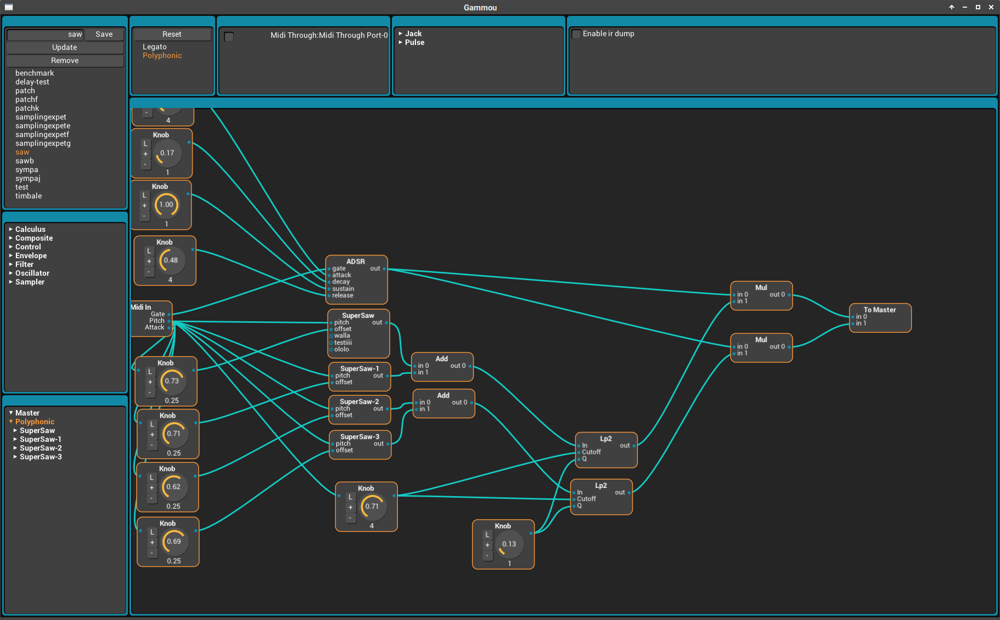

# Gammou

Gammou is a polyphonic modular sound synthesizer that be run as **VST** or **standalone** on Linux and Windows.

An llvm-based just in time compilation engine is used to translate the patches circuits into machine code, allowing them to be almost as fast as a native synthesizer plugin. Patches can be edited seamlessly in real time while synthesis is running and the resulting sound is guaranteed to be continuous as long as the change in the circuit does not introduce discontinuities.

